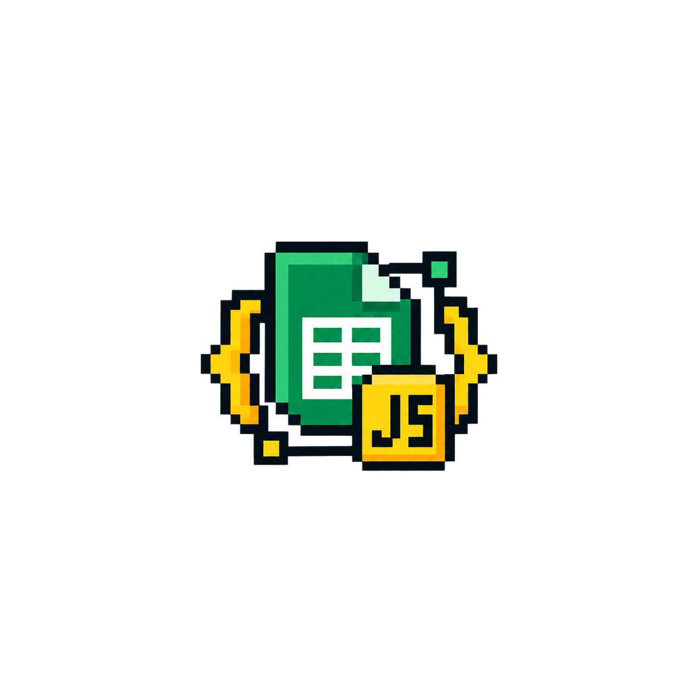

<div align="center">
  
  <h1>EMD </h1>
  <p><strong>Open-Source Low-to-Mid Level Event Operations Platform</strong></p>
</div>

---

## Overview

EMD (Event Management Database) is a lightweight, zero-cost event operations engine designed for small-to-mid scale events (up to 3,000+ attendees). It provides real-time attendee tracking, QR code check-ins, email pass dispatching, and offline-capable mobile scanner tools without requiring dedicated server infrastructure.

The system uses Google Workspace (Google Sheets and Google Apps Script) as a serverless backend database paired with a mobile Progressive Web Application (PWA) scanner interface for volunteers.

---

## Key Use Cases

- **Conference & Conclave Access Control**: Validate delegate credentials at main entrances, hall entrances, and specific tracks.
- **Meal & Logistics Tracking**: Enforce entitlement rules for breakfasts, lunches, dinners, or resident-only sessions.
- **Badge & Pass Dispatch**: Mint QR passes and deliver them via email with daily quota management.
- **Offline Registration Desks**: Continue scanning attendees when venue Wi-Fi or cellular networks drop.
- **Device Management**: Restrict volunteer access to authorized phones to prevent credential sharing.

---

## Key Features

- **Stateless Webhook API**: Google Apps Script acts as an API gateway handling authentication, scan validation, and metrics aggregation.
- **Offline PWA Scanner**: Built with HTML5, CSS3, and ES6 JS. Uses IndexedDB for offline queuing and background sync.
- **Idempotent Synchronization**: Scans generate a unique clientScanId (UUIDv4) to guarantee zero double-entry logs during retries or offline flushes.
- **Device Binding**: Accounts bind to primary and backup device IDs to maintain volunteer session security.
- **Concurrency Guards**: Uses Google LockService for atomic append-only ledger entries in Google Sheets.
- **Compact Memory Caching**: Uses CacheService chunking to eliminate spreadsheet read latency for up to 10,000 attendees.

---

## Repository Structure

```text
EMD/
├── frontend/                   # Client-side PWA Scanner app
│   ├── index.html              # Main HTML scanner view
│   ├── manifest.json           # Web App Manifest
│   ├── service-worker.js       # Offline service worker cache
│   ├── css/
│   │   └── style.css           # Minimalist CSS styles
│   ├── js/
│   │   ├── config.js           # Runtime API configuration
│   │   ├── api.js              # API client methods
│   │   ├── auth.js             # Session & device binding logic
│   │   ├── offlineQueue.js     # IndexedDB offline store
│   │   ├── scanner.js          # Camera & QR reader controller
│   │   └── ui.js               # UI router and event handlers
│   └── icons/                  # PWA application icons
├── backend/                    # Google Apps Script Web App Engine
│   ├── .clasp.json.template    # Clasp CLI deployment configuration
│   └── src/
│       ├── 01_WebhookAPI.gs    # API gateway and action router
│       ├── 02_ScannerHandlers.gs # Core scan validation & caching engine
│       ├── 03_AuthAndHelpers.gs  # Volunteer authentication & device locks
│       ├── 04_SetupWorkbook.gs # Database schema initializer
│       ├── 05_QRGenerator.gs   # Sequential ID & QuickChart QR minter
│       ├── 07_CSVImporter.gs   # Dynamic registration CSV importer
│       ├── 08_DashboardAPI.gs  # Real-time metrics & device manager
│       ├── EmailService.gs     # Quota-safe 100 passes/day email engine
│       ├── IDCardEmailTemplate.html # HTML pass template
│       └── appscript.json      # Project manifest (Asia/Kolkata timezone)
├── extensions/                 # Integrations and export helpers
│   ├── google-form-exporter/   # Google Form response exporter
│   └── vishwam-form-webhook/   # Global forum submission webhook
├── docs/                       # Detailed manuals and specs
│   ├── SETUP_AND_MIGRATION_GUIDE.md
│   ├── API_CONTRACT_AND_SPEC.md
│   ├── BACKEND_ARCHITECTURE_BRIEF.md
│   ├── SYSTEM_DOCUMENTATION.md
│   └── JAI_CONCLAVE_2026_MASTER_MANUAL.md
├── scripts/                    # Automation and setup scripts
│   ├── setup.sh                # Local environment setup script
│   └── deploy-backend.sh       # Clasp deployment helper script
├── EMD.png                     # System Logo
├── .env.example                # Environment variables template
├── package.json                # NPM tooling configuration
└── README.md                   # Project documentation
```

---

## Setup and Usage

### Prerequisites
- A Google account (Google Workspace or personal Gmail).
- Node.js (v18+) installed locally for development.

---

### Step 1: Create Google Drive Operations Folders
1. Open [Google Drive](https://drive.google.com).
2. Create a parent folder named `EMD_Operations`.
3. Inside it, create 4 subfolders:
   - `01_QR_Vault` (Stores generated QR images)
   - `02_ID_Cards` (Stores uploaded pass graphics)
   - `03_CSV_Import` (Target folder for registration CSV uploads)
   - `04_CSV_Archive` (Storage for processed CSV files)
4. Open each subfolder and copy its **Folder ID** from your browser URL bar:  
   `https://drive.google.com/drive/folders/YOUR_FOLDER_ID_HERE`

---

### Step 2: Set Up Backend Database (Google Apps Script)
1. Create a new Google Sheet named `EMD Master Database`.
2. Go to **Extensions > Apps Script**.
3. Rename the project to `EMD Backend Engine`.
4. Enable manifest file view: Gear ⚙️ (**Project Settings**) > Check **"Show 'appsscript.json' manifest file in editor"**.
5. Copy source files from `backend/src/`:
   - Replace `appsscript.json` contents with `backend/src/appsscript.json`.
   - Create 8 Script files (+ > Script) for each `.gs` file: `01_WebhookAPI`, `02_ScannerHandlers`, `03_AuthAndHelpers`, `04_SetupWorkbook`, `05_QRGenerator`, `07_CSVImporter`, `08_DashboardAPI`, and `EmailService`.
   - Create 1 HTML file (+ > HTML) named `IDCardEmailTemplate` (do not include `.html` in the name) and paste `backend/src/IDCardEmailTemplate.html`.
6. Initialize Workbook:
   - In the toolbar dropdown, select `setupWorkbook` and click **Run**. Grant permissions when prompted.
   - This creates 6 relational sheets (`00_Configuration` to `05_Automation_Log`).
7. Populate `00_Configuration`:
   - **Drive Folder IDs** (Column B, Rows 4–7): Paste your 4 Folder IDs.
   - **Volunteer Credentials** (Columns J–Q): Configure Admin (`ADM-01`) and Volunteers (`VOL-01`, `VOL-02`) with names, PINs (e.g., `1234`), and assigned checkpoints (`ALL` or `ENT,BAD`).
8. Deploy Web App:
   - Click **Deploy > New deployment**.
   - Select type: **Web app**.
   - Set **Execute as**: `Me (your-email@domain.com)`.
   - Set **Who has access**: `Anyone` (Required for volunteer phone scanner requests).
   - Click **Deploy** and copy the **Web App URL** (`https://script.google.com/macros/s/.../exec`).

---

### Step 3: Configure Frontend PWA Scanner
1. Open `frontend/js/config.js` and set your Web App URL:
   ```javascript
   API_URL: "https://script.google.com/macros/s/YOUR_SCRIPT_ID/exec",
   ```
2. Deploy the `frontend/` folder:
   - **GitHub Pages**: Set source to `main` branch and `/frontend` directory (or use GitHub Actions).
   - **Vercel / Netlify / Cloudflare Pages**: Set project root directory to `frontend`.

---

### Step 4: Local Development & CLI Tooling

```bash
# Clone repository
git clone git@github.com:potatobun321/EMD.git
cd EMD

# Initialize local environment
npm run setup

# Serve PWA scanner locally
npm run dev
```

Optional CLI deployment for Google Apps Script:
```bash
# Copy clasp config template and edit scriptId
cp backend/.clasp.json.template backend/.clasp.json

# Push backend updates directly to Google Apps Script
npm run push:backend
```

---

## Future Roadmap

- **Self-Hosted Engine**: Port the Google Apps Script backend to a standalone self-hosted service (Node.js / Go with SQLite or PostgreSQL) for full infrastructure freedom, zero Google daily quota limits, and higher request throughput.

---

## License

Distributed under the [MIT License](LICENSE).
